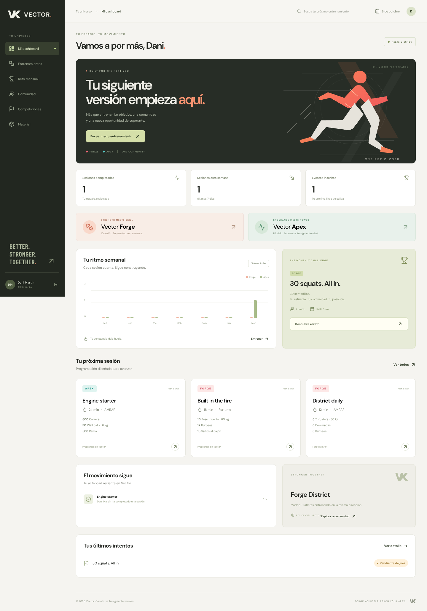

# Vector · Forge & Apex

Plataforma web en español para entrenamiento, boxes y competición. **Vector Forge** reúne la programación de CrossFit y fuerza; **Vector Apex**, la de carreras híbridas. Una sola cuenta conecta el entrenamiento diario, los retos online y la inscripción en eventos presenciales.

La web utiliza React, TypeScript y Vite; la API, FastAPI y Python. La base de datos relacional SQLite y los vídeos se guardan en tu máquina. No necesitas Docker, PostgreSQL ni servicios de pago para arrancar.



## Lanzar en tu Mac

Compatible con Mac Intel y Apple Silicon. Necesitas Git, Node.js **22 o posterior** y `uv`; los scripts crean `.venv` con Python **3.12**. El backend admite Python 3.11–3.12.

1. Instala [Homebrew](https://brew.sh/) si todavía no lo tienes. Después, abre Terminal:

   ```bash
   brew install git uv node
   ```

2. Clona el proyecto y entra en la carpeta:

   ```bash
   git clone --branch main https://github.com/SCGESTION/PRUEBA1.git
   cd PRUEBA1
   ```

   Si el repositorio es privado, usa una cuenta de GitHub con acceso y la autenticación habitual de Git; no guardes tokens en archivos del proyecto.

3. Instala las versiones del lockfile, compila la web y prepara una demostración:

   ```bash
   bash scripts/setup.sh --demo
   bash scripts/dev.sh
   ```

4. Abre `http://localhost:5173` en tu navegador. `Ctrl+C` detiene la API y la web iniciadas por el script. La API está en `http://localhost:8000`; su documentación interactiva, en `/docs`.

El primer arranque descarga dependencias y Python si hace falta. Los siguientes conservan los datos y usan los mismos lockfiles. `setup.sh --demo` es repetible: no duplica las cuentas ni los entrenamientos. Rechaza añadir cuentas demo a una base que ya contiene usuarios reales. `dev.sh` no crea cuentas demo.

Si quieres abrir la web compilada con un único proceso:

```bash
bash scripts/serve.sh
```

Abre `http://localhost:8000`. Usa esta opción después de `setup.sh`, o de ejecutar `npm run build` dentro de `web/`. `dev.sh` permite editar la interfaz y el backend con recarga automática.

## Perfiles de demostración

Todas estas cuentas tienen la contraseña **`VectorDemo2026!`**, exclusivamente para la base demo:

| Perfil | Email | Para probar |
| --- | --- | --- |
| Administrador Vector | `admin@vector.local` | Publicar programación, crear retos, gestionar boxes, juzgar vídeos y resolver alquileres. |
| Box oficial | `forge@vector.local` | Entrenamientos propios, eventos con marca Vector y selección de material. |
| Box normal | `norte@vector.local` | Entrenamientos propios, eventos independientes y selección de material. |
| Atleta de box | `atleta@vector.local` | Programación de Vector y del box, reto mensual e inscripción presencial. |
| Atleta libre | `libre@vector.local` | Programación de Vector e inscripción en eventos presenciales. |

La demo incluye dos boxes, programación Forge/Apex, un reto de sentadillas y dos eventos. No incluye resultados inventados en el ranking: aparecen después de enviar y aprobar vídeos. Los perfiles y accesos demo se muestran solo cuando la base fue inicializada con `--demo`.

## Cómo se utiliza

- **Administrador:** publica entrenamientos por fecha con un selector cerrado Forge/Apex y campos de formato, duración, nivel, movimientos, repeticiones o distancia y carga. Crea retos mensuales, da de alta boxes con su responsable y cambia su categoría oficial/normal.
- **Box oficial:** publica entrenamientos diarios visibles para sus atletas, inscribe su box en retos y organiza eventos presenciales bajo la marca Vector o una marca independiente.
- **Box normal:** publica sus entrenamientos e inscribe su box en retos. Sus eventos presenciales deben ser independientes; la API impide usar la marca Vector.
- **Ambos boxes:** eligen material Forge, Apex o ambos, según la disciplina de su evento, y solicitan alquiler por fechas y cantidades. Vector confirma o rechaza la solicitud; al confirmar se comprueba la disponibilidad del inventario en esas fechas.
- **Atleta de box:** ve programación general y la de su box. Puede subir un vídeo al reto mientras esté abierto y su box participe. El vídeo requiere consentimiento y solo lo pueden ver el atleta, el responsable de su box y la administración.
- **Atleta libre:** se registra sin box y se inscribe en eventos presenciales. También puede enviar un vídeo al reto abierto y competir individualmente; sus resultados no suman a un box.

Las sesiones y los permisos se validan en el servidor. El registro público crea únicamente atletas; las cuentas administradoras se crean desde la terminal y las de responsables de box desde administración. Las tablas, claves y relaciones están en [docs/DATABASE.md](docs/DATABASE.md).

## Crear tu base real y tu administrador

La instalación sin `--demo` inicializa el catálogo y las tablas sin añadir usuarios. Mantén la base real separada de la demostración. Desde la raíz del repositorio:

```bash
bash scripts/setup.sh
export VECTOR_DATA_DIR="$PWD/data/production"
PYTHONPATH=backend uv run --no-sync python -m vector.seed \
  --admin-email tu@empresa.com --admin-name "Administrador Vector"
bash scripts/dev.sh
```

El comando pide la contraseña dos veces sin mostrarla; debe tener al menos 10 caracteres. No incluyas contraseñas reales en los comandos ni reutilices la contraseña demo. Crea los boxes y sus responsables desde el panel de administración. Los atletas pueden registrarse eligiendo un box o el perfil libre.

Repite el `export VECTOR_DATA_DIR=...` cuando abras otra terminal para usar la misma base. Crear el administrador de nuevo con el mismo email no sobrescribe la cuenta: devuelve un conflicto. El servidor no añade un administrador ni usuarios demo automáticamente.

## Vídeo, sentadillas y ranking

La primera implementación del reto analiza **sentadillas al aire**: un vídeo continuo, cuerpo completo de perfil y una persona. Los vídeos MP4/MOV/WebM admiten hasta 100 MB. La plataforma conserva los envíos y las decisiones de los jueces.

Para instalar el analizador opcional y descargar los pesos oficiales con comprobación SHA-256:

```bash
bash scripts/setup-pose.sh
export VECTOR_POSE_MODEL="$PWD/data/models/yolo11n-pose.pt"
export VECTOR_POSE_DEVICE=cpu
bash scripts/dev.sh
```

El análisis YOLO Pose propone repeticiones y tiempo; **un administrador debe revisar el vídeo y aprobar el resultado** antes de entrar en el ranking. Solo se publica el mejor envío aprobado por atleta con las repeticiones objetivo completas, ordenado por tiempo. La clasificación de boxes utiliza el mejor tiempo aprobado de cada box e indica cuántos atletas han obtenido un resultado válido. Cuando el modelo no está configurado o el análisis falla, el envío pasa al circuito de revisión humana; no se simulan resultados de IA.

Consulta [docs/POSE.md](docs/POSE.md) para los requisitos de grabación, la instalación, la licencia del modelo y los límites del conteo. La integración necesita validación con vídeos deportivos etiquetados antes de utilizar sus medidas como criterio de una competición. Las pruebas sintéticas no demuestran precisión en atletas reales.

`setup.sh` instala el núcleo. Si vuelves a ejecutarlo después de instalar IA, ejecuta también `setup-pose.sh` para conservar las dependencias opcionales en `.venv`.

## Configuración y datos

Los scripts leen variables exportadas en la terminal. **No cargan `.env` automáticamente**. `.env.example` documenta opciones; no copies credenciales ni archivos `.env` a GitHub.

| Variable | Uso |
| --- | --- |
| `VECTOR_DATA_DIR` | Carpeta que contiene SQLite y `videos/`. Por defecto, `data/` en la raíz. |
| `VECTOR_ALLOWED_ORIGINS` | Orígenes admitidos en escrituras de la API. Por defecto, localhost/127.0.0.1 en 5173 y 8000. |
| `VECTOR_COOKIE_SECURE` | `false` para HTTP local; `true` detrás de HTTPS en un despliegue. |
| `VECTOR_POSE_MODEL` | Ruta absoluta a los pesos Pose verificados. |
| `VECTOR_POSE_DEVICE` | `cpu` por defecto; consulta las alternativas en `docs/POSE.md`. |
| `VECTOR_HOST`, `VECTOR_PORT` | Dirección y puerto de `serve.sh`; por defecto, 127.0.0.1 y 8000. |
| `VECTOR_CACHE_ROOT` | Cachés de instalación; por defecto, `.cache/` en la raíz. También puedes usar una carpeta temporal. |

`data/`, `.venv/`, `.cache/`, `web/node_modules/`, `web/dist/` y archivos de secretos están excluidos de Git. Los vídeos no son públicos ni se suben al repositorio. Antes de actualizar o borrar datos, consulta la copia de seguridad en [docs/DATABASE.md](docs/DATABASE.md).

## Validación y actualizaciones

```bash
bash scripts/test.sh
```

Ejecuta las pruebas de API, permisos, relaciones, alquileres y conteo Pose, y después el compilador TypeScript y la compilación de la web. Las pruebas utilizan carpetas temporales, sin modificar tu base local. Consulta [las comprobaciones realizadas](docs/VALIDATION.md).

Para traer cambios publicados:

```bash
git pull --ff-only
bash scripts/setup.sh
# Si utilizas el analizador opcional:
bash scripts/setup-pose.sh
bash scripts/dev.sh
```

Si ya tienes cambios locales, revísalos con `git status` antes de actualizar. Los scripts trabajan desde su propia carpeta, no dependen del directorio desde el que los invoques. Si 8000 o 5173 está ocupado, `dev.sh` te avisa sin detener procesos ajenos.

## Alcance de esta versión

Esta base funcional permite desarrollar y probar el ecosistema completo con persistencia local. Los alquileres son solicitudes y estimaciones en euros por unidad/día, con confirmación administrativa; no hay pagos, facturación ni logística de entrega integrada. Marcar un entrenamiento como completado registra una declaración del atleta. La inscripción presencial vincula al atleta con el evento; todavía no importa resultados de cronometradores externos.

Para publicar un servicio real, prepara alojamiento HTTPS, almacenamiento y copias de seguridad, gestión de acceso y validación del sistema de vídeo. Usa un único proceso de API en esta versión: la cola de análisis se ejecuta en el propio proceso y no es una cola distribuida. La base inicial utiliza esquema v1; los cambios futuros de esquema requieren migraciones antes de actualizar datos reales.

Los SVG de marca incluidos en `web/public/brand/` recrean los logotipos aportados como referencia visual; no son los archivos originales adjuntos. Puedes sustituirlos por los originales conservando los nombres `forge.svg`, `apex.svg` y `mark.svg`.
