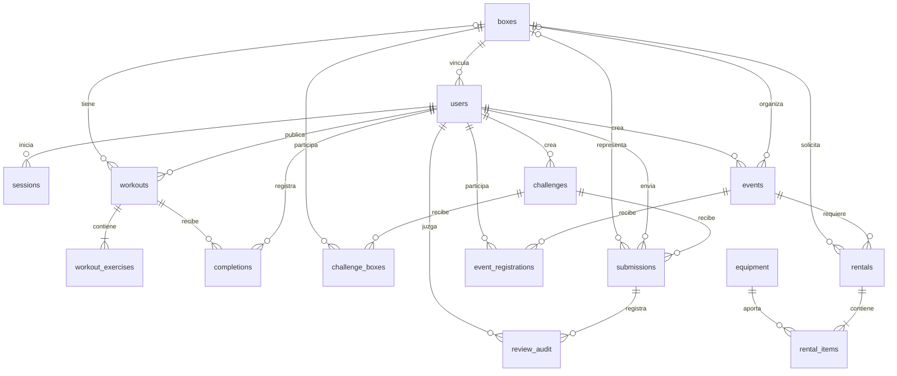

# Base de datos de Vector

SQLite guarda el modelo relacional en `data/vector.sqlite3`; los vídeos se guardan como archivos privados en `data/videos/`. `VECTOR_DATA_DIR` cambia la carpeta base para ambos. La aplicación crea el esquema al arrancar y activa claves foráneas en cada conexión. No hace falta crear las tablas manualmente.

El código del esquema está en [`backend/vector/db.py`](../backend/vector/db.py). La versión actual se registra en `settings.schema_version=1`. Las cantidades monetarias se almacenan en **céntimos enteros de euro**; la API las convierte a euros para mostrarlas.

## Relaciones



| Tabla | Contenido y relaciones |
| --- | --- |
| `settings` | Versión del esquema y marcador de base demo. |
| `boxes` | Nombre, localidad y categoría `official`/`standard`. |
| `users` | Perfil `admin`/`box_owner`/`athlete`, email único y hash de contraseña. `box_id` opcional en atletas; obligatorio en responsables. |
| `sessions` | Hash del token de sesión, `user_id` y caducidad. No almacena el token en texto plano. |
| `workouts` | Forge/Apex, ámbito general/de box, fecha, formato, nivel, duración y `author_id`. Un entrenamiento general no tiene `box_id`; uno de box sí. |
| `workout_exercises` | Movimientos ordenados, repeticiones o distancia y carga. Referencia `workout_id`. |
| `completions` | Relación atleta–entrenamiento y fecha de finalización declarada. Una entrada por pareja. |
| `challenges` | Reto con disciplina, objetivo de sentadillas, apertura, cierre y administrador autor. |
| `challenge_boxes` | Inscripción de un box en un reto; una entrada por pareja box–reto. |
| `submissions` | Reto, atleta, box opcional, nombre del archivo de vídeo, consentimiento, estado, resultado y última decisión. `reviewer_id` referencia al administrador juez. |
| `review_audit` | Historial de decisiones: envío, juez, aprobación/rechazo, repeticiones, tiempo y motivo. |
| `events` | Competición presencial Forge/Apex/ambas, fecha, ciudad, marca y autor. `box_id` es opcional para eventos creados por Vector. |
| `event_registrations` | Inscripción de un atleta en un evento; una entrada por pareja. |
| `equipment` | Material, categoría, stock, descripción y precio por unidad/día. |
| `rentals` | Evento, box, intervalo de alquiler, importe estimado, notas y estado `pending`/`confirmed`/`declined`. |
| `rental_items` | Material y cantidad de cada solicitud. Guarda el precio vigente al solicitarlo. |

Las uniones de entrenamientos, participantes, retos, eventos y alquileres usan claves foráneas. Los índices aceleran sesiones por caducidad, envíos por reto/estado y alquileres por estado/fechas. Un índice único parcial permite un único responsable por box. El registro público no permite crear un administrador ni un responsable de box.

## Reglas del flujo

La API comprueba los permisos además de las restricciones de SQLite. Un responsable solo publica entrenamientos para su box y solo solicita material para sus propios eventos. Un box normal puede organizar competiciones independientes; utilizar la marca Vector exige un box oficial. Los dos tipos acceden al catálogo de alquiler.

Los atletas ven programación de Vector y la de su box. En los retos, un atleta de box necesita que su box esté inscrito; un atleta libre puede competir individualmente. `submissions.box_id` conserva el box representado al enviar el vídeo, y es nulo para un atleta libre. Solo el atleta autor, su responsable de box y la administración pueden consultar el vídeo.

Los estados de los envíos son:

```text
queued → processing → review → approved / rejected
                     ↘ failed → revisión administrativa
```

Sin modelo disponible, el envío llega a `review` sin inventar métricas. Un fallo inesperado pasa a `failed`. Si el proceso se interrumpe, al arrancar de nuevo los envíos que estaban pendientes de análisis pasan a revisión humana. El procesamiento es local, dentro del proceso de la API; esta versión debe ejecutarse con un solo proceso, sin múltiples workers.

La aprobación exige las repeticiones exactas del reto, un tiempo positivo y un motivo. Cada decisión queda registrada en `review_audit`. El ranking toma el mejor envío aprobado de cada atleta y lo ordena por tiempo; en empate usa fecha de envío e identificador. La clasificación de boxes utiliza el mejor tiempo aprobado del box y muestra sus atletas con resultado válido. Los atletas libres no aparecen en la clasificación de boxes.

Las solicitudes de alquiler no reservan stock hasta que Vector las confirma. Las fechas incluyen ambos extremos; el total es la suma de precio por unidad/día × cantidad × días. Al confirmar, una transacción `BEGIN IMMEDIATE` comprueba el stock contra los alquileres ya confirmados con fechas superpuestas, evitando confirmar dos solicitudes que excedan las unidades disponibles. No se procesa ningún pago.

## Inicialización, demo y datos reales

`python -m vector.seed --demo`, con `PYTHONPATH=backend`, prepara datos de prueba una sola vez y rechaza mezclarlos con una base que ya contiene usuarios reales. La base demo utiliza credenciales públicas de demostración y debe mantenerse separada.

Para datos reales, elige una carpeta distinta, por ejemplo `export VECTOR_DATA_DIR="$PWD/data/production"`, y ejecuta el comando interactivo `--admin-email` del [README](../README.md). Las contraseñas se guardan con scrypt y salt individual. Las sesiones utilizan cookies HttpOnly y los tokens se guardan como hashes; para un despliegue HTTPS se debe activar `VECTOR_COOKIE_SECURE=true`.

`CREATE TABLE IF NOT EXISTS` no sustituye un sistema de migraciones: un cambio futuro del esquema debe incluir la transformación explícita de una base existente antes de actualizar una instalación real. Esta versión no ofrece borrado de usuarios o vídeos desde la interfaz; cualquier política de conservación y eliminación debe desarrollarse para el despliegue final.

## Copia de seguridad en macOS

La copia debe incluir **SQLite y los vídeos de la misma carpeta de datos**. Detén primero el servidor con `Ctrl+C` y espera a que termine el análisis pendiente. Así no entrarán nuevos vídeos mientras se realiza la copia. No copies únicamente `vector.sqlite3` mientras hay escrituras: SQLite utiliza WAL y puede tener datos recientes en archivos auxiliares.

Desde la raíz del repositorio y con el mismo `VECTOR_DATA_DIR` que utilizas para lanzar Vector:

```bash
export VECTOR_BACKUP_DIR="$HOME/Vector Backups"
uv run --no-sync python - <<'PY'
from datetime import datetime, timezone
import os
from pathlib import Path
import shutil
import sqlite3

source = Path(os.environ.get("VECTOR_DATA_DIR", "data")).resolve()
database = source / "vector.sqlite3"
if not database.is_file():
    raise SystemExit("No existe la base indicada; revisa VECTOR_DATA_DIR.")

stamp = datetime.now(timezone.utc).strftime("%Y%m%dT%H%M%S%fZ")
backup = Path(os.environ["VECTOR_BACKUP_DIR"]).expanduser() / stamp
backup.mkdir(parents=True, exist_ok=False)
with sqlite3.connect(database.as_uri() + "?mode=ro", uri=True) as src:
    with sqlite3.connect(backup / "vector.sqlite3") as dst:
        src.backup(dst)
        if dst.execute("PRAGMA integrity_check").fetchone()[0] != "ok":
            raise SystemExit("La comprobación de integridad de la copia falló.")
if (source / "videos").exists():
    shutil.copytree(source / "videos", backup / "videos")
print(f"Copia creada en {backup}")
PY
```

La API de copia de SQLite incorpora los datos confirmados del WAL. Con el servidor detenido, la copia de vídeos corresponde al mismo estado de la base. Guarda la copia en una ubicación con acceso restringido: contiene datos personales y vídeos. Los pesos opcionales de IA se pueden recuperar con `setup-pose.sh`; no forman parte de esta copia mínima.

Para comprobar una restauración, apunta `VECTOR_DATA_DIR` a la carpeta de una copia y lanza `serve.sh` con la API anterior detenida. Conserva los datos originales y no sobrescribas una instalación activa. Las sesiones copiadas pueden seguir vigentes; antes de utilizar una restauración en otro entorno, invalídalas con `DELETE FROM sessions` mediante una conexión SQLite.
